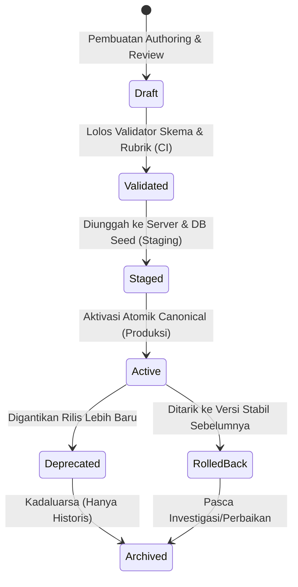

# Protokol Rilis Konten (Content Release Protocol)

Dokumen ini mendefinisikan siklus hidup, spesifikasi versioning, integritas kriptografis, aktivasi atomik, dan manajemen aset untuk seluruh rilis modul edukasi Finspire.

---

## 1. Siklus Hidup Rilis Konten (Content Lifecycle)

Konten narasi Finspire bersifat **deklaratif, terpisah dari kode aplikasi, dan tidak dapat diubah (immutable)** setelah dirilis. Siklus rilis mengikuti state machine berikut:



### 1.1 Definisi Status Rilis

| Status | Deskripsi | Akses Pengguna Biasa | Modifikasi Diizinkan |
| :--- | :--- | :--- | :--- |
| `draft` | Dalam penulisan/editing lokal oleh author konten. Hanya ada di filesystem author/branch staging. | Tidak (404/403) | Ya (lokal saja) |
| `validated` | Lolos skema JSON Draft 2020-12, validator rubrik pedagogis, linting narasi, dan digest check. | Tidak | Tidak |
| `staged` | Terdaftar di database PostgreSQL dengan status `staged` untuk verifikasi internal guru/QA di environment staging. | Khusus Role QA/Admin | Tidak |
| `active` | **Rilis kanonikal saat ini**. Tepat 1 rilis berstatus `active` per channel rilis pada satu waktu. | Ya (Semua Pemain) | **Sangat Dilarang** (Immutable) |
| `deprecated` | Rilis lama yang digantikan oleh rilis aktif baru. Sesi bermain yang sedang berlangsung boleh menyelesaikan percobaan. | Read-only historis | Tidak |
| `rolled_back`| Rilis bermasalah yang ditarik kembali ke versi rilis sebelumnya secara atomik. | Dihentikan/Fallback | Tidak |
| `archived` | Rilis purnatugas. Hanya tersimpan untuk audit kelulusan dan konsistensi catatan ledger. | Read-only Ledger | Tidak |

---

## 2. Skema Versioning & Format Identifikasi

Setiap rilis konten wajib memuat dua layer versioning:

1. **`releaseId` (Identitas Rilis Kanonikal)**:
   - Format: `YYYY.MM-v<increment>` (Contoh: `2026.03-v1`) untuk rilis produksi resmi.
   - Format: `<name>-v<increment>-draft` (Contoh: `pilot-v1-draft`) untuk rilis uji coba/pilot.
2. **`schemaVersion`**:
   - Format: Mengacu pada URI JSON Schema Draft 2020-12 (`https://json-schema.org/draft/2020-12/schema`).
   - Engine validator: Mematuhi `content-release.schema.json`.

---

## 3. Verifikasi Integritas SHA-256 (Manifest & Chapters)

Integritas paket rilis diverifikasi menggunakan hashing kriptografis SHA-256. Tidak ada rilis yang boleh diaktifkan tanpa verifikasi digest yang cocok antara manifest dan artefak file.

### 3.1 Struktur Manifest (`manifest.json`)

```json
{
  "releaseId": "pilot-v1-draft",
  "title": "Finspire Pilot Release: Fondasi Literasi Keuangan",
  "version": "1.0.0",
  "publishedAt": "2026-03-21T00:00:00Z",
  "schemaVersion": "2020-12",
  "chapters": [
    {
      "chapterId": "chapter-01",
      "title": "Bab 1: Menghadapi Tawaran Pinjaman Online",
      "path": "chapter-01.json",
      "sha256": "d54671dfe6d2c6e449fba84d17744230268252486d5b5549b595b73f3a1bb22b"
    },
    {
      "chapterId": "chapter-02",
      "title": "Bab 2: Membedakan Kebutuhan dan Keinginan Arisan",
      "path": "chapter-02.json",
      "sha256": "f89a24e2014ec7e654cfd0522cd78152885740b0e2d9672247563436a8a3db26"
    }
  ],
  "assetDictionary": {
    "bg_pasar_sore": {
      "path": "/assets/content/pilot-v1/bg/pasar-sore.webp",
      "sha256": "e3b0c44298fc1c149afbf4c8996fb92427ae41e4649b934ca495991b7852b855"
    }
  }
}
```

### 3.2 Alur Verifikasi Integritas

1. **Authoring / CI**:
   - Skrip `npm run content:validate` menghitung digest SHA-256 dari setiap file chapter JSON.
   - Memastikan digest yang tertera pada `manifest.json` cocok 100% dengan hash aktual file di direktori.
2. **Server Ingestion**:
   - Sebelum menyisipkan record ke tabel `content_releases`, server menghitung ulang hash `manifest.json` dan seluruh file chapter yang disertakan.
   - Bila terdapat perbedaan 1 bit sekalipun, ingest dibatalkan dengan error `CONTENT_INTEGRITY_MISMATCH`.
3. **Klien / PWA Cache Manager**:
   - Saat klien mengunduh rilis untuk mode offline (`/api/v1/content/releases/:releaseId/bundle`), klien memvalidasi digest setiap chapter sebelum menyimpannya ke IndexedDB (`content_store`).

---

## 4. Aktivasi Atomik & Aturan Rollback

### 4.1 Prosedur Aktivasi Atomik

Aktivasi rilis baru dilakukan dalam **satu transaksi database PostgreSQL** untuk mencegah kondisi balapan (*race condition*) di mana tidak ada rilis aktif atau ada dua rilis aktif bersamaan.

```sql
-- Transaksi Aktivasi Atomik Rilis
BEGIN;

-- 1. Kunci baris tabel untuk mencegah update paralel
SELECT id FROM content_releases WHERE status = 'active' FOR UPDATE;

-- 2. Turunkan status rilis aktif sebelumnya menjadi deprecated
UPDATE content_releases
SET status = 'deprecated',
    updated_at = NOW()
WHERE status = 'active';

-- 3. Naikkan status rilis target menjadi active
UPDATE content_releases
SET status = 'active',
    activated_at = NOW(),
    updated_at = NOW()
WHERE release_id = :targetReleaseId
  AND status = 'staged';

COMMIT;
```

### 4.2 Prosedur Rollback Tanpa Merusak Riwayat

Jika rilis aktif (`2026.03-v2`) ditemukan mengandung kekeliruan narasi yang fatal:
1. Administrator menjalankan perintah rollback atomik ke rilis stabil sebelumnya (`2026.03-v1`).
2. Status `2026.03-v2` diubah menjadi `rolled_back`.
3. Status `2026.03-v1` diaktifkan kembali menjadi `active`.
4. **Prinsip Immutability Riwayat**:
   - Seluruh record `playthrough_attempts`, `gameplay_actions`, dan `reward_ledger` yang telah dicatat dengan `release_id = '2026.03-v2'` **TIDAK DIHAPUS DAN TIDAK DIUBAH**.
   - Ledger hadiah tetap valid untuk audit kelulusan pemain yang telah menyelesaikan sesi tersebut.
   - Percobaan baru yang dimulai pasca rollback akan terikat ke `release_id = '2026.03-v1'`.

---

## 5. Invalidation Cache & Strategi Distribusi

### 5.1 Hierarki Cache Konten

| Jenis Artefak | Cache Klien / PWA | Header HTTP Server | Mekanisme Invalidation |
| :--- | :--- | :--- | :--- |
| `manifest.json` | Network-first, fallback ke cache IndexedDB lokal | `Cache-Control: public, max-age=300, stale-while-revalidate=600, must-revalidate` | Poll manifest versi saat online; deteksi perubahan `releaseId` / hash. |
| Chapter JSON | Cache-first (IndexedDB) setelah bundle terunduh | `Cache-Control: public, max-age=86400, immutable` (URL berbasis hash rilis) | URL atau path membawa versi rilis unik (e.g. `/content/releases/2026.03-v1/chapter-01.json`). |
| Media Aset (WebP/Audio) | Cache-first (CacheStorage PWA) | `Cache-Control: public, max-age=31536000, immutable` | Asset fingerprinted via content hash (`asset.hash123.webp`). |

### 5.2 Penanganan Percobaan Sedang Berjalan (*In-Flight Attempt*)

Ketika server mengaktifkan rilis baru saat seorang murid sedang bermain di kelas:
1. Klien mendeteksi sinyal rilis baru via response sync header `x-active-content-release: 2026.03-v2`.
2. Jika murid sedang berada di tengah-tengah percobaan bab (`status = 'in_progress'`):
   - Klien **TIDAK BOLEH merestart atau mengganti skrip bab secara mendadak** karena dapat menyebabkan referensi node rusak (*broken scene pointer*).
   - Murid diizinkan menyelesaikan bab berjalan menggunakan konten versi `release_id` yang sedang aktif di memori klien.
   - Saat bab selesai, klien mengunduh bundle rilis baru di latar belakang sebelum mengizinkan murid memulai bab berikutnya.

---

## 6. Manajemen Aset Multimedia & WebM Transparan

### 6.1 Pemisahan Kunci Logis vs Path Fisik

Konten narasi Finspire mengacu pada aset media hanya menggunakan **Kunci Logis (Logical Key)**, bukan path file relatif atau absolut. Manifest bertindak sebagai penyelesai (*resolver*):

- **Dalam JSON Chapter**:
  ```json
  "visual": {
    "backgroundKey": "bg_balai_warga",
    "characterKey": "char_pak_rt_bicara"
  }
  ```
- **Dalam `manifest.json` (`assetDictionary`)**:
  ```json
  "bg_balai_warga": {
    "path": "/assets/content/pilot-v1/bg/balai-warga.a8f9c2.webp",
    "sha256": "...",
    "mimeType": "image/webp"
  },
  "char_pak_rt_bicara": {
    "path": "/assets/content/pilot-v1/anim/pak-rt-bicara.b1c2d3.webm",
    "posterPath": "/assets/content/pilot-v1/chars/pak-rt-poster.e4f5a6.webp",
    "sha256": "...",
    "mimeType": "video/webm",
    "hasAlpha": true,
    "reducedMotionFallbackKey": "char_pak_rt_static"
  }
  ```

### 6.2 Standar WebM Transparan & Fallback Ramah Spek Rendah

Animasi karakter dengan latar belakang transparan menggunakan format WebM VP9/Alpha. Untuk menjamin performa pada laptop sekolah berspesifikasi rendah (dual-core Celeron, RAM 4GB):

1. **Wajib Memiliki Poster Image**:
   - Setiap aset video transparan wajib mendefinisikan `posterPath` berupa gambar WebP statis berkualitas tinggi.
   - Jika browser gagal menginisialisasi akselerasi perangkat keras video dalam 1,5 detik, sistem visual otomatis beralih (*graceful fallback*) ke gambar poster statis tanpa memblokir teks cerita.
2. **Kepatuhan Aksesibilitas (`prefers-reduced-motion`)**:
   - Jika preferensi sistem operasi murid atau pengaturan PWA mengaktifkan `reduced-motion`:
   - Animasi WebM transparan tidak diputar.
   - Renderer game langsung menggunakan `reducedMotionFallbackKey` (gambar ilustrasi ekspresi statis).
3. **Status Aset Fase 02**:
   - Seluruh aset grafis dan video pada fase arsitektur ini menggunakan referensi skema mock/draft; aset binary final akan dioptimasi pada fase asset bundling khusus.

---

## 7. Kebijakan Seeding & Lingkungan Deployment

| Environment | Kebijakan Seeding Konten | Validasi Diwajibkan |
| :--- | :--- | :--- |
| **Lokal (Dev)** | Diizinkan seeding langsung dari folder `content/releases/pilot-v1-draft` via skrip `npm run db:seed`. | Lolos `npm run content:validate`. |
| **Staging** | Diunggah via CLI deployment admin. Terdaftar dengan status `staged`. | Lolos seluruh test suite regresi CI/CD. |
| **Produksi** | **DILARANG SEEDING OTOMATIS**. Hanya dapat diaktifkan melalui endpoint/skrip migrasi berotentikasi admin yang memverifikasi checksum SHA-256 di database PostgreSQL. | Audit kelulusan verifikasi QA & Guru. |
