# Finspire Relational Data Model & Entity Specifications

Dokumen ini mendefinisikan skema basis data relasional PostgreSQL 16 yang dikelola menggunakan **Drizzle ORM** untuk **Finspire Production Pilot**.

---

## 1. Diagram Relasi Entitas (Entity-Relationship Diagram — ERD)

```mermaid
erDiagram
    %% Auth & User Identities
    users ||--o{ sessions : "has active"
    users ||--o{ accounts : "has credentials"
    users ||--|| player_profiles : "possesses"
    users ||--o{ cohort_memberships : "enrolled in"
    users ||--o{ consent_records : "records"
    users ||--o{ installations : "operates"
    users ||--o{ chapter_playthroughs : "executes"
    users ||--o{ reward_ledger : "earns"
    users ||--|| player_projections : "projects"
    users ||--o{ player_streaks : "maintains"
    users ||--o{ push_subscriptions : "subscribes"

    %% Schools & Cohorts
    schools ||--o{ cohorts : "manages"
    cohorts ||--o{ cohort_memberships : "contains"
    cohorts ||--o{ cohort_invitations : "issues"
    users ||--o{ credential_reset_audits : "authorized as teacher"
    users ||--o{ credential_reset_audits : "targeted as student"

    %% Content & Gameplay
    content_releases ||--o{ chapter_playthroughs : "provides context"
    chapter_playthroughs ||--o{ gameplay_actions : "records"
    chapter_playthroughs ||--o{ reward_ledger : "triggers"
    gameplay_actions ||--o{ reward_ledger : "produces"

    %% Audit & Analytics
    users ||--o{ audit_logs : "triggers audit"

    users {
        varchar id PK "Internal UUID / Better Auth ID"
        varchar player_code UK "Pseudonym (e.g. FOX-8291-KPL)"
        varchar name "Pseudonym / Display Alias"
        varchar email UK "Technical Alias (e.g. fox_8291@finspire.invalid)"
        boolean email_verified "Default true for internal aliases"
        varchar role "student | teacher | admin"
        timestamp created_at "UTC creation timestamp"
        timestamp updated_at "UTC update timestamp"
    }

    sessions {
        varchar id PK "Session Token Hash"
        varchar user_id FK "References users(id)"
        timestamp expires_at "Session expiry timestamp"
        varchar ip_address "Hashed / Truncated IP"
        varchar user_agent "User agent summary"
    }

    accounts {
        varchar id PK "Account credential ID"
        varchar user_id FK "References users(id)"
        varchar account_id "Player Code identifier"
        varchar provider_id "credential provider"
        varchar password_hash "Argon2id / Scrypt hash"
    }

    player_profiles {
        varchar user_id PK, FK "References users(id)"
        varchar avatar_key "Selected Foxy outfit/avatar key"
        varchar preferred_locale "id-ID"
        varchar school_id FK "References schools(id) nullable"
        varchar cohort_id FK "References cohorts(id) nullable"
        timestamp created_at "Registration time"
        timestamp updated_at "Profile modification time"
    }

    schools {
        varchar id PK "School UUID"
        varchar name "School official name"
        varchar npsn UK "Nomor Pokok Sekolah Nasional"
        varchar city "City / Regency"
        varchar province "Province"
        boolean is_active "Operational flag"
        timestamp created_at "Record created"
    }

    cohorts {
        varchar id PK "Cohort UUID"
        varchar school_id FK "References schools(id)"
        varchar name "Class/Cohort name (e.g. Kelas X AKL 1)"
        varchar academic_year "2026/2027"
        boolean is_active "Cohort active flag"
        timestamp created_at "Created at"
    }

    cohort_memberships {
        varchar id PK "Membership UUID"
        varchar user_id FK "References users(id)"
        varchar cohort_id FK "References cohorts(id)"
        varchar role "student | teacher | observer"
        timestamp enrolled_at "Enrollment date"
        varchar status "active | archived"
    }

    cohort_invitations {
        varchar access_code PK "6-char alphanumeric code"
        varchar cohort_id FK "References cohorts(id)"
        integer max_uses "Usage ceiling"
        integer current_uses "Active counter"
        timestamp expires_at "Validity threshold"
        timestamp created_at "Issued at"
    }

    consent_records {
        varchar id PK "Consent record UUID"
        varchar user_id FK "References users(id)"
        varchar consent_type "parental_consent | student_assent | tos_privacy"
        varchar status "granted | revoked"
        varchar captured_via "in_app_form | school_import"
        timestamp captured_at "Audit timestamp"
        timestamp valid_until "Expiry threshold"
    }

    credential_reset_audits {
        varchar id PK "Audit UUID"
        varchar target_user_id FK "References users(id) [Student]"
        varchar teacher_user_id FK "References users(id) [Authorizer]"
        varchar cohort_id FK "References cohorts(id)"
        varchar reset_reason "lost_passphrase | device_switch"
        timestamp issued_at "Issued at"
        timestamp redeemed_at "Redeemed at"
    }

    installations {
        varchar id PK "Client-generated UUID v4"
        varchar user_id FK "References users(id)"
        varchar platform "android | ios | windows | macos | linux"
        varchar client_version "App semver"
        timestamp first_seen_at "Installation creation"
        timestamp last_seen_at "Last sync timestamp"
    }

    content_releases {
        varchar release_id PK "e.g. pilot-v1"
        varchar schema_version "2026.03-v1"
        varchar status "draft | proposed | approved | published | retired"
        varchar manifest_sha256 "SHA-256 hash of manifest.json"
        boolean is_active "True if currently active pilot version"
        timestamp published_at "Official publish timestamp"
    }

    chapter_playthroughs {
        varchar attempt_id PK "Attempt UUID v4"
        varchar user_id FK "References users(id)"
        varchar installation_id FK "References installations(id)"
        varchar release_id FK "References content_releases(release_id)"
        varchar chapter_id "chapter-01 | chapter-02"
        varchar status "in_progress | completed_pass | completed_failsoft | abandoned"
        integer current_day_index "Last simulated day/month reached"
        varchar current_node_id "Current scene node ID"
        jsonb initial_accounts "Starting simulated money snapshot"
        jsonb current_accounts "Latest simulated money ledger snapshot"
        timestamp started_at "Creation timestamp"
        timestamp completed_at "Completion timestamp"
    }

    gameplay_actions {
        varchar action_id PK "Client UUID v4"
        varchar attempt_id FK "References chapter_playthroughs(attempt_id)"
        varchar user_id FK "References users(id)"
        varchar installation_id FK "References installations(id)"
        bigint client_sequence "Monotonic sequence per installation"
        varchar action_type "CHOICE_SELECTED | TRANSFER_ANSWERED | BOSS_SUBMITTED"
        varchar scene_node_id "Scene node ID where action occurred"
        varchar choice_id "Selected choice ID"
        jsonb payload_data "Raw choice payload / answer / artifact"
        varchar status "accepted | duplicate | conflict | rejected"
        varchar resolution_code "OK | IDEMPOTENT_RETRY | SLOT_OCCUPIED | INVALID_STATE"
        timestamp client_occurred_at "Untrusted client timestamp"
        timestamp server_received_at "Server monotonic reception time"
    }

    reward_ledger {
        bigserial id PK "Append-only monotonic sequence"
        varchar user_id FK "References users(id)"
        varchar attempt_id FK "References chapter_playthroughs(attempt_id)"
        varchar action_id FK "References gameplay_actions(action_id)"
        varchar release_id "Content release identifier"
        varchar chapter_id "chapter-01 | chapter-02"
        varchar source_node_id "Node ID triggering reward"
        varchar reward_type "xp | coin | badge"
        integer amount "Integer reward value"
        varchar badge_id "Badge identifier if type=badge"
        timestamp awarded_at "UTC timestamp of grant"
    }

    player_projections {
        varchar user_id PK, FK "References users(id)"
        integer total_xp "Materialized total XP"
        integer total_coins "Materialized total virtual coins"
        integer current_level "Calculated player level"
        varchar current_identity "Survivor | Planner | Guardian | etc."
        jsonb unlocked_chapters "Array of unlocked chapter IDs"
        jsonb completed_chapters "Array of completed chapter IDs"
        jsonb unlocked_badges "Array of earned badge IDs"
        integer current_streak "Current consecutive active days"
        integer highest_streak "All-time streak record"
        date last_active_date_wib "Last active date in Asia/Jakarta"
        timestamp last_rebuilt_at "Last projection calculation time"
    }

    player_streaks {
        varchar id PK "Streak record UUID"
        varchar user_id FK "References users(id)"
        date activity_date_wib "Calendar date in Asia/Jakarta"
        integer activity_count "Count of qualifying actions"
        boolean streak_freeze_used "Whether freeze shield was consumed"
        timestamp recorded_at "Server receipt timestamp"
    }

    push_subscriptions {
        varchar id PK "Subscription UUID"
        varchar user_id FK "References users(id)"
        varchar installation_id FK "References installations(id)"
        varchar endpoint UK "Browser Push Service Endpoint"
        varchar p256dh_key "Client public encryption key"
        varchar auth_key "Client auth secret"
        boolean is_active "Delivery status flag"
        timestamp created_at "Subscription time"
        timestamp updated_at "Update time"
    }

    first_party_analytics {
        varchar id PK "Event UUID"
        varchar session_pseudonym "Rotated daily hash (no raw user ID)"
        varchar event_name "app_opened | chapter_started | boss_failed | etc."
        varchar event_category "engagement | pedagogy | performance"
        jsonb properties "Telemetry payload without PII"
        timestamp created_at "Server timestamp"
    }

    audit_logs {
        bigserial id PK "Sequential audit ID"
        varchar actor_user_id "Teacher or Admin User ID"
        varchar actor_role "teacher | admin | system"
        varchar action_type "RESET_CREDENTIAL | EXPORT_COHORT | DELETE_ACCOUNT"
        varchar target_entity_type "user | cohort | school"
        varchar target_entity_id "Target ID"
        jsonb audit_details "Metadata and justification"
        timestamp created_at "Immutable timestamp"
    }
```

---

## 2. Kamus Data Rinci (*Data Dictionary*)

### 2.1 Identitas & Keamanan Pengguna (*Auth & Security*)

#### Tabel: `users`
- **Tujuan**: Menyimpan akun pengguna pseudonim untuk murid, guru, dan admin sistem.
- **Owner**: `AuthModule` (Better Auth Adapter).
- **Mutability**: Mutable (hanya pembaruan status dan role).
- **Retensi**: Durasi program pilot + 90 hari masa retensi arsip evaluasi sekolah.

| Kolom | Tipe Data | Nullable | Default | Batasan & Keterangan |
|---|---|---|---|---|
| `id` | `VARCHAR(36)` | NO | — | **PRIMARY KEY**. UUID v4 internal. |
| `player_code` | `VARCHAR(16)` | NO | — | **UNIQUE INDEX**. Format `FOX-XXXX-YYY` (misal: `FOX-7829-KPL`). |
| `name` | `VARCHAR(64)` | NO | — | Nama alias / samaran yang dipilih murid (misal: "Budi Petualang"). |
| `email` | `VARCHAR(128)` | NO | — | **UNIQUE INDEX**. Alias teknis berdomain `.invalid` (misal: `fox_7829@finspire.invalid`). Menjamin kompatibilitas engine Better Auth tanpa menyimpan email asli murid. |
| `email_verified` | `BOOLEAN` | NO | `true` | Selalu `true` untuk akun pseudonim internal. |
| `role` | `VARCHAR(16)` | NO | `'student'` | Enum: `student`, `teacher`, `admin`. |
| `created_at` | `TIMESTAMP WITH TIME ZONE` | NO | `NOW()` | Waktu pembuatan akun (UTC). |
| `updated_at` | `TIMESTAMP WITH TIME ZONE` | NO | `NOW()` | Waktu pembaruan akun (UTC). |

#### Tabel: `accounts`
- **Tujuan**: Menyimpan hash kredensial kata sandi / frasa sandi (*passphrase*).
- **Owner**: `AuthModule`.
- **Keterangan**: Hash menggunakan algoritma modern Argon2id melalui Better Auth. Passphrase mentah tidak pernah disimpan di disk atau memori jangka panjang.

#### Tabel: `sessions`
- **Tujuan**: Sesi aktif yang terotentikasi di server.
- **Owner**: `AuthModule`.
- **Keterangan**: Token sesi dikirimkan melalui cookie browser bertipe `HttpOnly`, `Secure`, `SameSite=Lax`.

#### Tabel: `installations`
- **Tujuan**: Mendaftarkan instalasi klien PWA unik pada perangkat murid tanpa menyimpan secret client.
- **Owner**: `SyncCoordinator`.
- **Indeks Unik**: `(id)` PK, `(user_id, id)` INDEX.

---

### 2.2 Struktur Sekolah & Kohor (*Schools & Cohorts*)

#### Tabel: `schools`
- **Tujuan**: Data institusi sekolah mitra pelaksanaan pilot.
- **Indeks Unik**: `npsn` (Nomor Pokok Sekolah Nasional).

#### Tabel: `cohorts`
- **Tujuan**: Kelompok kelas / rombel yang dibimbing oleh guru tertentu.
- **Relasi**: `school_id` merujuk ke `schools(id)`.

#### Tabel: `cohort_memberships`
- **Tujuan**: Keanggotaan murid atau guru di dalam kelas.
- **Indeks Unik**: `(user_id, cohort_id)` — mencegah duplikasi pendaftaran murid pada kelas yang sama.

#### Tabel: `cohort_invitations`
- **Tujuan**: Kode akses 6 karakter (misal: `SMK1-XAK`) untuk pendaftaran mandiri murid di kelas.
- **Indeks Unik**: `access_code` PRIMARY KEY.

---

### 2.3 Gameplay, Skenario, & Log Tindakan (*Gameplay Engine*)

#### Tabel: `content_releases`
- **Tujuan**: Katalog versi rilis konten yang bersifat immutable.
- **Owner**: `ContentRegistry`.

| Kolom | Tipe Data | Nullable | Batasan & Keterangan |
|---|---|---|---|
| `release_id` | `VARCHAR(32)` | NO | **PRIMARY KEY**. Misal: `pilot-v1-draft` atau `pilot-v1`. |
| `schema_version`| `VARCHAR(16)` | NO | Versi skema JSON (misal: `2026.03-v1`). |
| `status` | `VARCHAR(16)` | NO | Enum: `draft`, `proposed`, `approved`, `published`, `retired`. |
| `manifest_sha256`| `CHAR(64)` | NO | Checksum integritas SHA-256 berkas manifest.json. |
| `is_active` | `BOOLEAN` | NO | Flag aktif default untuk client bootstrap. |
| `published_at` | `TIMESTAMP WITH TIME ZONE`| YES | Tanggal publikasi resmi. |

#### Tabel: `chapter_playthroughs` (Attempts)
- **Tujuan**: Sesi bermain (*attempt*) untuk satu bab tertentu oleh seorang murid.
- **Owner**: `DomainEngine`.
- **Prinsip**: Setiap kali pemain mengulang cerita dari awal, sebuah sesi `attempt_id` baru diterbitkan. Percobaan lama tetap tersimpan untuk audit pedagogis (*append-only attempt history*).

| Kolom | Tipe Data | Nullable | Keterangan |
|---|---|---|---|
| `attempt_id` | `VARCHAR(36)` | NO | **PRIMARY KEY** (UUID v4). |
| `user_id` | `VARCHAR(36)` | NO | FK merujuk ke `users(id)`. |
| `installation_id`| `VARCHAR(36)`| NO | FK merujuk ke `installations(id)`. |
| `release_id` | `VARCHAR(32)` | NO | FK merujuk ke `content_releases(release_id)`. |
| `chapter_id` | `VARCHAR(16)` | NO | `chapter-01` atau `chapter-02`. |
| `status` | `VARCHAR(24)` | NO | Enum: `in_progress`, `completed_pass`, `completed_failsoft`, `abandoned`. |
| `current_node_id`| `VARCHAR(32)`| NO | Posisi simpul terakhir murid dalam attempt. |
| `initial_accounts`| `JSONB` | NO | Snapshot saldo awal (kas, tabungan, darurat, utang). |
| `current_accounts`| `JSONB` | NO | Snapshot saldo terkini server-calculated. |
| `started_at` | `TIMESTAMP WITH TIME ZONE`| NO | Waktu mulai attempt (UTC). |
| `completed_at` | `TIMESTAMP WITH TIME ZONE`| YES | Waktu selesai attempt (UTC). |

#### Tabel: `gameplay_actions`
- **Tujuan**: Log seluruh tindakan dan keputusan yang dipilih murid dalam attempt tertentu.
- **Owner**: `SyncCoordinator` & `DomainEngine`.
- **Indeks Unik**:
  - `(attempt_id, scene_node_id)` **UNIQUE**: Menegakkan prinsip **First-Accepted Decision Wins**. Murid tidak dapat mengubah keputusan pada adegan yang sudah diselesaikan dalam satu attempt yang sama.
  - `(installation_id, client_sequence)` **UNIQUE**: Menjamin deteksi duplikasi transmisi offline sync.

| Kolom | Tipe Data | Nullable | Keterangan |
|---|---|---|---|
| `action_id` | `VARCHAR(36)` | NO | **PRIMARY KEY** (UUID v4 dari klien). |
| `attempt_id` | `VARCHAR(36)` | NO | FK merujuk ke `chapter_playthroughs(attempt_id)`. |
| `user_id` | `VARCHAR(36)` | NO | FK merujuk ke `users(id)`. |
| `installation_id`| `VARCHAR(36)`| NO | FK merujuk ke `installations(id)`. |
| `client_sequence`| `BIGINT` | NO | Nomor urut lokal yang dibangkitkan IndexedDB. |
| `action_type` | `VARCHAR(32)` | NO | Enum: `CHOICE_SELECTED`, `TRANSFER_ANSWERED`, `MINIGAME_COMPLETED`, `BOSS_SUBMITTED`. |
| `scene_node_id`| `VARCHAR(32)` | NO | ID simpul adegan (misal: `CH1-SC-01`, `CH2-SC-05`). |
| `choice_id` | `VARCHAR(32)` | YES | ID pilihan yang diambil murid (misal: `ch1-c1-airminum`). |
| `payload_data` | `JSONB` | NO | Data payload mentah aksi klien. |
| `status` | `VARCHAR(16)` | NO | Enum: `accepted`, `duplicate`, `conflict`, `rejected`. |
| `resolution_code`| `VARCHAR(32)`| NO | Stable error/success code (misal: `OK`, `IDEMPOTENT_RETRY`, `DECISION_OCCUPIED`). |
| `client_occurred_at`| `TIMESTAMP WITH TIME ZONE`| NO | Timestamp perangkat murid (metadata tidak tepercaya). |
| `server_received_at`| `TIMESTAMP WITH TIME ZONE`| NO | Timestamp penerimaan resmi server (UTC). |

---

### 2.4 Ledger Hadiah & Proyeksi Pemain (*Append-Only Reward Ledger*)

#### Tabel: `reward_ledger`
- **Tujuan**: Sumber kebenaran mutlak perolehan XP, Koin, dan Badge pemain. Bersifat murni **append-only**.
- **Owner**: `RewardCalculator` & `DomainEngine`.
- **Indeks Unik Kritis**:
  `UNIQUE (user_id, release_id, source_node_id, reward_type)`
  - **Jaminan Integritas**: Constraint unik ini di tingkat basis data secara fisik mencegah duplikasi hadiah (*anti-farming*) saat murid mengulang scene yang sama atau mengirimkan batch yang sama berulang kali.

| Kolom | Tipe Data | Nullable | Keterangan |
|---|---|---|---|
| `id` | `BIGSERIAL` | NO | **PRIMARY KEY**. ID sekuensial append-only. |
| `user_id` | `VARCHAR(36)` | NO | FK merujuk ke `users(id)`. |
| `attempt_id` | `VARCHAR(36)` | NO | FK merujuk ke `chapter_playthroughs(attempt_id)`. |
| `action_id` | `VARCHAR(36)` | NO | FK merujuk ke `gameplay_actions(action_id)`. |
| `release_id` | `VARCHAR(32)` | NO | Rilis konten aktif. |
| `chapter_id` | `VARCHAR(16)` | NO | Identifier bab. |
| `source_node_id`| `VARCHAR(32)`| NO | Simpul sumber hadiah (misal: `CH1-SC-01`, `BOSS-CH1`). |
| `reward_type` | `VARCHAR(16)` | NO | Enum: `xp`, `coin`, `badge`. |
| `amount` | `INTEGER` | NO | Nilai hadiah (wajib integer non-negatif). |
| `badge_id` | `VARCHAR(32)` | YES | Identifier lencana (misal: `BADGE-SURVIVOR`) jika type=`badge`. |
| `awarded_at` | `TIMESTAMP WITH TIME ZONE`| NO | Waktu pemberian resmi server (UTC). |

#### Tabel: `player_projections`
- **Tujuan**: Tampilan ter-materialisasi (*materialized projection*) status pemain untuk pembacaan cepat UI tanpa perlu menjumlahkan seluruh baris ledger di setiap request.
- **Owner**: `ProjectionUpdater`.
- **Sifat**: Dapat dibangun ulang (*100% rebuildable*) kapan saja dari gabungan tabel `reward_ledger` dan `gameplay_actions`.

| Kolom | Tipe Data | Nullable | Keterangan |
|---|---|---|---|
| `user_id` | `VARCHAR(36)` | NO | **PRIMARY KEY** merujuk ke `users(id)`. |
| `total_xp` | `INTEGER` | NO | Akumulasi XP terverifikasi. |
| `total_coins` | `INTEGER` | NO | Akumulasi Koin Foxy terverifikasi. |
| `current_level`| `INTEGER` | NO | Level pemain terhitung ($1 + \lfloor \text{total\_xp} / 100 \rfloor$). |
| `current_identity`| `VARCHAR(32)`| NO | Gelar aktif terkini: `Pemula`, `Survivor`, `Planner`. |
| `unlocked_chapters`| `JSONB` | NO | Array bab terbuka: `["chapter-01", "chapter-02"]`. |
| `completed_chapters`| `JSONB` | NO | Array bab yang telah lulus evaluasi: `["chapter-01"]`. |
| `unlocked_badges`| `JSONB` | NO | Array badge yang telah diraih: `["BADGE-SURVIVOR"]`. |
| `current_streak`| `INTEGER` | NO | Jumlah hari aktif berurutan saat ini. |
| `highest_streak`| `INTEGER` | NO | Rekor streak tertinggi sepanjang masa. |
| `last_active_date_wib`| `DATE` | YES | Tanggal kalender aktivitas terakhir dalam WIB. |
| `last_rebuilt_at`| `TIMESTAMP WITH TIME ZONE`| NO | Waktu terakhir proyeksi diperbarui. |

---

### 2.5 Streak Harian, Notifikasi, & Audit (*Lifecycle & Operations*)

#### Tabel: `player_streaks`
- **Tujuan**: Mencatat riwayat keaktifan harian murid berdasarkan zona waktu bisnis `Asia/Jakarta` (WIB).
- **Indeks Unik**: `UNIQUE (user_id, activity_date_wib)`.
- **Keterangan**: Mencegah penambahan streak lebih dari 1 kali dalam hari kalender WIB yang sama.

#### Tabel: `push_subscriptions`
- **Tujuan**: Menyimpan endpoint Web Push standar W3C untuk pengingat belajar harian.
- **Indeks Unik**: `endpoint` UNIQUE.

#### Tabel: `audit_logs`
- **Tujuan**: Jejak audit tidak dapat diubah (*immutable audit trail*) untuk seluruh tindakan administratif guru atau sistem (misal: rotasi password murid di lab sekolah, ekspor rekap nilai kelas, penghapusan akun murid).

---

## 3. Strategi Pengindeksan Database (*Database Indexing Strategy*)

Untuk menjamin performa query tinggi pada single VPS dengan ribuan aksi sinkronisasi:

1. `idx_actions_attempt_seq`: `CREATE INDEX idx_actions_attempt_seq ON gameplay_actions (attempt_id, client_sequence ASC);`
2. `idx_actions_user_received`: `CREATE INDEX idx_actions_user_received ON gameplay_actions (user_id, server_received_at DESC);`
3. `idx_reward_user_lookup`: `CREATE INDEX idx_reward_user_lookup ON reward_ledger (user_id, reward_type);`
4. `idx_playthroughs_user_chapter`: `CREATE INDEX idx_playthroughs_user_chapter ON chapter_playthroughs (user_id, chapter_id, status);`
5. `idx_memberships_cohort`: `CREATE INDEX idx_memberships_cohort ON cohort_memberships (cohort_id, role);`
6. `idx_streaks_user_date`: `CREATE INDEX idx_streaks_user_date ON player_streaks (user_id, activity_date_wib DESC);`
