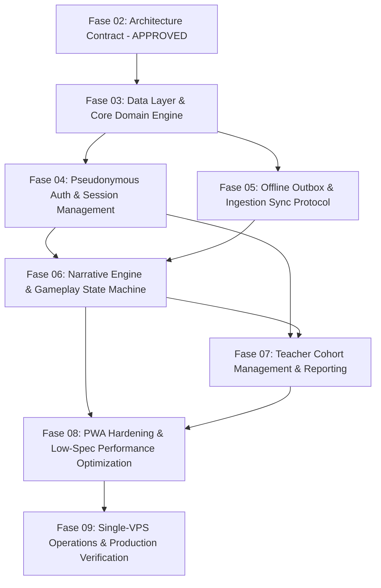

# Rencana Implementasi Bertahap (Implementation Plan: Phases 03–09)

Dokumen ini memetakan tahapan implementasi teknis Finspire dari Fase 03 hingga Fase 09, merinci batas direktori file (*file boundaries*), migrasi basis data, kriteria pintu keluar (*exit gate criteria*), dan strategi mitigasi risiko.

---

## 1. Peta Jalan & Ketergantungan Fase

---

## 2. Rincian Eksekusi per Fase

### 2.1 Fase 03: Layer Akses Data & Domain Inti (Data Layer & Core Domain)

- **Ketergantungan Prasyarat**: Fase 02 (Kontrak arsitektur disetujui manusia).
- **Batasan File (`File Boundaries`)**:
  - `src/db/schema/*` (Drizzle ORM schema definitions untuk 14 tabel kanonikal).
  - `src/db/migrations/*` (File SQL migrasi yang digenerate oleh `drizzle-kit`).
  - `src/db/index.ts` (Koneksi pool node-postgres terkonfigurasi untuk Single-VPS).
  - `src/lib/clock/*` (`SystemClockProvider`, `MockClockProvider` untuk WIB).
  - `src/lib/crypto/*` (Utilitas generator hash SHA-256 dan validasi digest).
  - `scripts/seed-pilot-content.ts` (Seeder rilis konten `pilot-v1-draft` ke DB).
- **Migrasi Data**: Migrasi inisialisasi skema (0000_init_finspire_schema.sql).
- **Kriteria Pintu Keluar (Exit Gate Criteria)**:
  - Seluruh 14 tabel terbuat dengan constraint lengkap di PostgreSQL pengujian.
  - Seeder konten rilis pilot berhasil memasukkan data dan memverifikasi SHA-256.
  - Seluruh tes integrasi database (`TC-CNT-001`, `TC-OPS-001`) lolos 100%.
- **Strategi Rollback**: Drop skema via skrip `npm run db:drop-test`.
- **Risiko & Mitigasi**: Perbedaan tipe data UUID/JSONB pada Postgres lokal vs Docker; dimitigasi dengan menggunakan image resmi `postgres:16-alpine`.

---

### 2.2 Fase 04: Otentikasi Pseudonim & Manajemen Sesi (Pseudonymous Auth)

- **Ketergantungan Prasyarat**: Fase 03.
- **Batasan File (`File Boundaries`)**:
  - `src/lib/auth/better-auth.ts` (Konfigurasi instance Better Auth).
  - `src/lib/auth/player-code.ts` (Generator & parser kode unik `FOX-XXXX-YYY`).
  - `src/lib/auth/argon2.ts` (Hashing passphrase tanpa PII).
  - `src/app/api/auth/[...all]/route.ts` (Route handler Better Auth).
  - `src/app/api/v1/auth/pseudonymous/*` (Handler kustom pendaftaran & login pseudonim).
  - `src/app/api/v1/schools/cohorts/reset-credential/*` (Handler reset sandi oleh guru).
- **Migrasi Data**: Tabel pelengkap `credential_reset_audits` dan index `users(player_code)`.
- **Kriteria Pintu Keluar (Exit Gate Criteria)**:
  - Murid dapat mendaftar dengan Player Code dan Passphrase tanpa email/telepon.
  - Sesi tersimpan aman dalam cookie HTTP-only dengan token acak berkekuatan tinggi.
  - Guru dapat mereset sandi murid di kelasnya; tindakan tercatat di audit log.
  - Tes `TC-AUTH-001` dan `TC-AUTH-002` lolos.
- **Strategi Rollback**: Nonaktifkan rute auth pseudonim via middleware bendera fitur (*feature flag*).
- **Risiko & Mitigasi**: Kegagalan modul natif Argon2 pada arsitektur tertentu; gunakan pustaka `@node-rs/argon2` teruji lintas platform.

---

### 2.3 Fase 05: Protokol Outbox Offline & Sinkronisasi (Offline Sync Protocol)

- **Ketergantungan Prasyarat**: Fase 03, Fase 04.
- **Batasan File (`File Boundaries`)**:
  - `src/lib/offline/idb-schema.ts` (Definisi database Dexie / idb-keyval untuk IndexedDB).
  - `src/lib/offline/sync-state-machine.ts` (Mesin status outbox: Idle, Syncing, Failed, etc.).
  - `src/lib/offline/network-listener.ts` (Detektor status koneksi online/offline).
  - `src/app/api/v1/sync/batch/route.ts` (Endpoint penerimaan batch aksi gameplay).
  - `src/services/sync-evaluator.service.ts` (Evaluasi transaksi ledger hadiah di server).
- **Migrasi Data**: Index performa pada `gameplay_actions(installation_id, client_sequence)`.
- **Kriteria Pintu Keluar (Exit Gate Criteria)**:
  - Aksi tersimpan di outbox lokal saat perangkat offline dan terkirim otomatis saat online.
  - Server memproses batch secara atomik: mendeteksi duplikat, menolak manipulasi, dan mencatat reward tepat satu kali ke `reward_ledger`.
  - Tes `TC-OFF-001`, `TC-OFF-002`, dan `TC-OFF-003` lolos 100%.
- **Strategi Rollback**: Nonaktifkan sinkronisasi otomatis, alihkan klien ke mode antrean tertahan (*hold in outbox*).
- **Risiko & Mitigasi**: Tabrakan ID aksi; dicegah dengan UUID v4 client-generated unik.

---

### 2.4 Fase 06: Engine Naratif & Visual Gameplay (Narrative Engine)

- **Ketergantungan Prasyarat**: Fase 04, Fase 05.
- **Batasan File (`File Boundaries`)**:
  - `src/lib/narrative/engine.ts` (State machine traversal node narasi).
  - `src/lib/narrative/rubric-evaluator.ts` (Kalkulasi skor mastery check Bab 1 & 2).
  - `src/components/novel/DialogueCard.tsx` (Komponen render dialog karakter).
  - `src/components/novel/VisualStage.tsx` (Render latar belakang WebP & video WebM).
  - `src/components/novel/ChoiceContainer.tsx` (Pilihan keputusan dengan timer).
  - `src/stores/gameplay-store.ts` (Zustand store untuk status bermain lokal).
- **Migrasi Data**: Tidak ada.
- **Kriteria Pintu Keluar (Exit Gate Criteria)**:
  - Pemain dapat menyelesaikan Bab 1 dan Bab 2 dari awal hingga akhir.
  - Kelulusan (*pass/fail*) ditentukan secara matematis oleh skor rubrik, bukan pilihan manual.
  - Seluruh aset WebM memiliki poster fallback yang muncul jika WebM dimatikan.
- **Strategi Rollback**: Muat ulang bundel konten fallback dari rilis stabil sebelumnya.
- **Risiko & Mitigasi**: Lag animasi di laptop spek rendah; terapkan CSS containment dan deteksi `prefers-reduced-motion`.

---

### 2.5 Fase 07: Manajemen Kelas & Laporan Guru (Teacher Dashboard)

- **Ketergantungan Prasyarat**: Fase 04, Fase 06.
- **Batasan File (`File Boundaries`)**:
  - `src/app/(dashboard)/teacher/page.tsx` (Halaman ringkasan kelas guru).
  - `src/app/(dashboard)/teacher/cohorts/[id]/page.tsx` (Detail capaian murid per kelas).
  - `src/app/api/v1/schools/cohorts/*` (API CRUD kelas dan analitik agregat).
  - `src/services/analytics-aggregator.service.ts` (Agregasi skor pemahaman kelas).
- **Migrasi Data**: Indeks relasi `cohort_members(cohort_id, user_id)`.
- **Kriteria Pintu Keluar (Exit Gate Criteria)**:
  - Guru dapat membuat kelas, membagikan Kode Kelas, dan melihat daftar murid terdaftar.
  - Guru dapat melihat grafik agregat penguasaan konsep pinjol dan arisan.
  - Terverifikasi anti-IDOR (`TC-SCH-001` lolos): Guru B tidak dapat mengakses data Guru A.
- **Strategi Rollback**: Sembunyikan navigasi dashboard guru di UI.
- **Risiko & Mitigasi**: Kueri agregasi lambat saat jumlah murid banyak; gunakan kueri terindeks dan caching memori sementara berbatas waktu.

---

### 2.6 Fase 08: Pengerasan PWA & Kinerja Spek Rendah (PWA Hardening)

- **Ketergantungan Prasyarat**: Fase 06, Fase 07.
- **Batasan File (`File Boundaries`)**:
  - `src/sw.ts` / Konfigurasi Service Worker PWA (Precache aset statis & offline fallback).
  - `src/middleware.ts` (Injeksi header keamanan: CSP, HSTS, X-Frame-Options, Cookie security).
  - `public/manifest.json` (Web App Manifest untuk instalasi PWA di Android/Windows).
  - `src/components/common/CleanSignOutButton.tsx` (Pembersihan memori perangkat bersama).
- **Migrasi Data**: Tidak ada.
- **Kriteria Pintu Keluar (Exit Gate Criteria)**:
  - PWA dapat diinstal (*Add to Home Screen*) dan berfungsi penuh saat internet dimatikan.
  - Tombol "Keluar Bersih" membersihkan token dan data sensitif lokal (`TC-PRIV-001` lolos).
  - Audit Google Lighthouse PWA score >= 90 dan Performance >= 85 pada simulasi low-end.
- **Strategi Rollback**: Unregister service worker via script emergency fallback.
- **Risiko & Mitigasi**: Cache poisoning service worker; terapkan header `Cache-Control: no-cache` pada file worker itu sendiri.

---

### 2.7 Fase 09: Operasional Single-VPS & Verifikasi Produksi (VPS Operations)

- **Ketergantungan Prasyarat**: Fase 08.
- **Batasan File (`File Boundaries`)**:
  - `docker-compose.prod.yml` (Konfigurasi kontainer PostgreSQL 16 + Next.js Standalone).
  - `deploy/nginx/finspire.conf` (Konfigurasi reverse proxy, SSL Certbot, buffer limit 1M).
  - `deploy/scripts/backup-db.sh` (Skrip cron pencadangan harian terenkripsi ke volume lokal).
  - `deploy/scripts/restore-db.sh` (Skrip pemulihan darurat dari berkas dump).
  - `docs/ops/RUNBOOK.md` (Panduan operasional dan penanganan insiden untuk operator VPS).
- **Migrasi Data**: Eksekusi skema produksi dan verifikasi hashing konten.
- **Kriteria Pintu Keluar (Exit Gate Criteria)**:
  - Server aktif pada VPS Ubuntu tunggal, memuat SSL HTTPS dengan sertifikat valid.
  - Simulasi pemadaman dan pemulihan backup database terbukti berhasil 100%.
  - Uji beban serentak (40 murid per kelas melakukan sync bersamaan) mempertahankan waktu respons server di bawah 250ms tanpa crash memori.
- **Strategi Rollback**: Alihkan traffic DNS ke instans standby atau halaman statis pemeliharaan (*maintenance page*).
- **Risiko & Mitigasi**: Kehabisan memori (*OOM killer*) pada VPS 2GB RAM; atur swap file 4GB dan batasi `max_connections` PostgreSQL ke angka 50.
