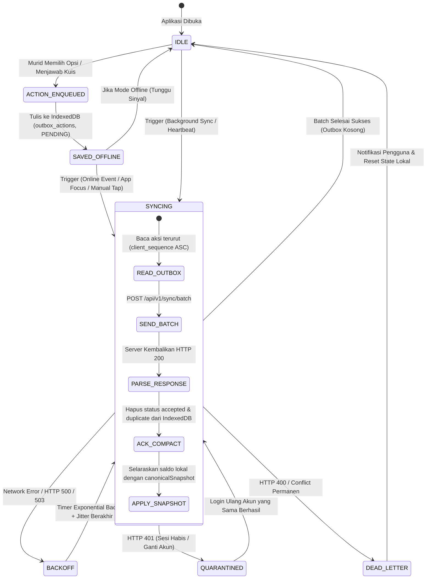

# Finspire Offline Synchronization Protocol Specification (v1.0)

Dokumen ini mendefinisikan protokol sinkronisasi offline-first antara klien PWA Finspire (IndexedDB) dan server Next.js (PostgreSQL) melalui rute `/api/v1/sync/batch`.

---

## 1. Diagram Mesin State Sinkronisasi Klien (*Client Sync State Machine*)



---

## 2. Struktur Payload Kontrak Protokol

### 2.1 Skema Permintaan (*Batch Request Schema*)
```json
{
  "protocolVersion": "1.0",
  "batchId": "a1b2c3d4-e5f6-4a5b-8c9d-0e1f2a3b4c5d",
  "installationId": "f47ac10b-58cc-4372-a567-0e02b2c3d479",
  "lastServerCursor": "10492",
  "actions": [
    {
      "actionId": "7c9e6679-7425-40de-944b-e07fc1f90ae7",
      "attemptId": "8f14e45f-c49b-43de-957f-f4e92a2a7b88",
      "clientSequence": 1,
      "actionType": "CHOICE_SELECTED",
      "sceneNodeId": "CH1-SC-01",
      "choiceId": "ch1-c1-airminum",
      "contentVersion": "pilot-v1-draft",
      "clientOccurredAt": "2026-09-21T02:15:30.120Z",
      "payload": {
        "choiceId": "ch1-c1-airminum",
        "intentDescription": "Bawa air minum sendiri dari rumah",
        "selectedOptionIndex": 2
      }
    },
    {
      "actionId": "9b1deb4d-3b7d-4bad-9bdd-2b0d7b3dcb6d",
      "attemptId": "8f14e45f-c49b-43de-957f-f4e92a2a7b88",
      "clientSequence": 2,
      "actionType": "CHOICE_SELECTED",
      "sceneNodeId": "CH1-SC-02",
      "choiceId": "ch1-c2-fotokopi",
      "contentVersion": "pilot-v1-draft",
      "clientOccurredAt": "2026-09-21T02:18:10.450Z",
      "payload": {
        "choiceId": "ch1-c2-fotokopi",
        "intentDescription": "Bayar iuran fotokopi tugas wajib",
        "selectedOptionIndex": 0
      }
    }
  ]
}
```

### 2.2 Skema Respons (*Batch Response Schema*)
```json
{
  "batchId": "a1b2c3d4-e5f6-4a5b-8c9d-0e1f2a3b4c5d",
  "results": [
    {
      "actionId": "7c9e6679-7425-40de-944b-e07fc1f90ae7",
      "status": "accepted",
      "code": "OK",
      "message": "Aksi berhasil divalidasi dan dicatat dalam canonical ledger.",
      "retryable": false,
      "canonicalConsequence": {
        "sceneNodeId": "CH1-SC-01",
        "choiceId": "ch1-c1-airminum",
        "deltaSimulatedMoney": 0,
        "newAccounts": {
          "availableCash": 10000,
          "goalSavings": 0,
          "emergencyFund": 0,
          "debt": 0
        },
        "rewardsAwarded": [
          { "type": "xp", "amount": 10 },
          { "type": "coin", "amount": 5 }
        ],
        "nextNodeId": "CH1-SC-02",
        "foxyReaction": "FX-HAPPY"
      }
    },
    {
      "actionId": "9b1deb4d-3b7d-4bad-9bdd-2b0d7b3dcb6d",
      "status": "accepted",
      "code": "OK",
      "message": "Aksi berhasil divalidasi dan dicatat dalam canonical ledger.",
      "retryable": false,
      "canonicalConsequence": {
        "sceneNodeId": "CH1-SC-02",
        "choiceId": "ch1-c2-fotokopi",
        "deltaSimulatedMoney": -2000,
        "newAccounts": {
          "availableCash": 8000,
          "goalSavings": 0,
          "emergencyFund": 0,
          "debt": 0
        },
        "rewardsAwarded": [
          { "type": "xp", "amount": 10 },
          { "type": "coin", "amount": 5 }
        ],
        "nextNodeId": "CH1-SC-03",
        "foxyReaction": "FX-IDLE"
      }
    }
  ],
  "nextServerCursor": "10494",
  "canonicalSnapshot": {
    "attemptId": "8f14e45f-c49b-43de-957f-f4e92a2a7b88",
    "chapterId": "chapter-01",
    "currentNodeId": "CH1-SC-03",
    "accounts": {
      "availableCash": 8000,
      "goalSavings": 0,
      "emergencyFund": 0,
      "debt": 0
    },
    "totalXp": 20,
    "totalCoins": 10,
    "currentStreak": 1,
    "identity": "Survivor"
  },
  "contentNotice": {
    "latestActiveReleaseId": "pilot-v1-draft",
    "requiresUpdate": false
  },
  "serverTime": "2026-09-21T02:20:00.125Z"
}
```

---

## 3. Aturan Penanganan Skenario Batas & Konflik (*Edge Cases & Conflict Resolution*)

### 3.1 Prinsip Pilihan Pertama Menang (*First-Accepted Decision Wins*)
Dalam satu sesi bermain bab (*attempt*), setiap adegan cerita hanya memiliki satu slot keputusan.
- **Kasus A: Retry Identik (Idempotent Retry)**
  - Murid mengirimkan kembali `actionId` dan payload yang sama persis (misal akibat koneksi terputus sesaat setelah server menulis ke database).
  - Server mengenali `action_id` pada tabel `gameplay_actions`.
  - **Hasil**: Server mengembalikan status `"duplicate"`, kode `"IDEMPOTENT_RETRY"`, beserta `canonicalConsequence` terdahulu. Klien dapat dengan aman menghapus aksi ini dari outbox.
- **Kasus B: Pilihan Berbeda pada Scene yang Sama (Conflict)**
  - Murid memanipulasi penyimpanan lokal atau membuka dua tab terpisah, memilih Opsi A di Tab 1 (terkirim dulu) dan Opsi B di Tab 2 (terkirim belakangan).
  - Server mendeteksi bahwa slot `(attempt_id, scene_node_id)` telah terisi oleh Opsi A.
  - **Hasil**: Aksi kedua diberi status `"conflict"`, kode `"DECISION_ALREADY_RECORDED"`, `retryable: false`. Server melampirkan `canonicalSnapshot` resmi (Opsi A). Klien membatalkan pilihan lokal kedua dan menyelaraskan state dengan Opsi A.

### 3.2 Transaksi Server & Urutan Aksi (*Transaction Boundary & Out-of-Order Execution*)
1. Seluruh batch aksi (maksimal 50 aksi) diproses di dalam **satu transaksi database PostgreSQL** (`db.transaction`).
2. Server mengambil baris kunci pada attempt menggunakan `SELECT ... FOR UPDATE` untuk mencegah race condition lintas request.
3. Aksi dieksekusi secara berurutan berdasarkan `clientSequence` terendah ke tertinggi.
4. Jika salah satu aksi di tengah batch mengalami kegagalan validasi domain fatal (`rejected`), transaksi di-rollback secara parsial atau seluruh batch ditandai dengan hasil per-item yang jelas sehingga klien tahu persis aksi mana yang berhasil dan mana yang ditolak.

### 3.3 Penanganan Jam Klien yang Tidak Sinkron (*Client Clock Independence*)
Jam perangkat murid (misal: diatur sengaja ke masa depan atau baterai CMOS habis) **DILARANG KERAS** digunakan sebagai penentu keabsahan gameplay.
- Nilai `clientOccurredAt` hanya dicatat sebagai metadata audit penunjang investigasi pedagogis.
- **Penghitungan Streak Harian & Hadiah**: 100% menggunakan timestamp resmi server `server_received_at` yang dikonversi ke kalender bisnis `Asia/Jakarta` (WIB).

### 3.4 Batas Perangkat Sekolah Bersama & Pergantian Akun (*Shared Device & Account Switch*)
Finspire dirancang untuk laboratorium komputer sekolah dan ponsel pinjaman:
1. **Isolasi Outbox Lokal**: Store `outbox_actions` pada IndexedDB menyertakan indeks `(user_id, client_sequence)`.
2. **Karantina Sesi**: Jika sinkronisasi menerima respons `HTTP 401 Unauthorized`:
   - Outbox lokal **TIDAK DIHAPUS**.
   - Outbox dikarantina (*locked*) hingga pengguna melakukan login ulang dengan **Player Code yang sama**.
3. **Pergantian Akun (Account Switch)**:
   - Jika Akun A logout dan Akun B login pada peramban yang sama, klien **DILARANG** mengirimkan antrean milik Akun A.
   - Aksi milik Akun B diproses di jalurnya sendiri.
4. **Explicit Logout Cleanup**:
   - Jika murid menekan tombol Logout eksplisit: Aplikasi memeriksa apakah ada aksi berstatus `PENDING` di outbox.
   - Jika ada, aplikasi menampilkan peringatan konfirmasi: *"Masih ada progres offline yang belum tersimpan ke server. Yakin ingin keluar?"*
   - Jika murid tetap memilih logout, data privat lokal murid dibersihkan dari IndexedDB untuk melindungi kerahasiaan di perangkat bersama.

---

## 4. Algoritma Pengulangan & Kompaksi Outbox (*Retry & Compaction Algorithm*)

### 4.1 Pemicu Sinkronisasi (*Sync Triggers*)
Klien memicu evaluasi outbox pada 5 kondisi:
1. **Startup**: Saat aplikasi pertama kali dimuat.
2. **Online Event**: Event peramban `window.addEventListener('online')`.
3. **Visibility Change**: Ketika tab aplikasi kembali aktif (`document.visibilityState === 'visible'`).
4. **Manual Retry**: Murid menekan tombol "Sinkronkan Sekarang" pada status bar.
5. **Background Sync API**: Menggunakan `self.registration.sync.register('finspire-outbox-sync')` pada peramban yang mendukung (Chromium/Android), sebagai pelengkap (*enhancement*).

### 4.2 Pola Exponential Backoff dengan Jitter
Jika koneksi internet mengalami kegagalan transmisi (jaringan drop, HTTP 500/502/503/504):
$$\text{Delay} = \min(\text{MaxDelay}, \text{BaseDelay} \times 2^{\text{attempt}}) + \text{RandomJitter}$$
- `BaseDelay` = 2 detik.
- `MaxDelay` = 60 detik.
- `RandomJitter` = Nilai acak antara 0 s.d. 1.000 milidetik (mencegah fenomena *thundering herd* saat satu lab sekolah kembali online serentak).
- Setelah 5 kali kegagalan berturut-turut, status bar menampilkan indikator oranye: *"Menunggu jaringan stabil... (Tersimpan aman di perangkat)"*.

### 4.3 Kompaksi Outbox (*Compaction & Cleanup*)
- Aksi dengan hasil `status: "accepted"` atau `status: "duplicate"` segera dihapus dari store `outbox_actions` di IndexedDB.
- Aksi dengan hasil `status: "conflict"` atau `status: "rejected"` dipindahkan ke store `dead_letter_actions` untuk pemecahan masalah tanpa menghambat aksi-aksi berikutnya.
