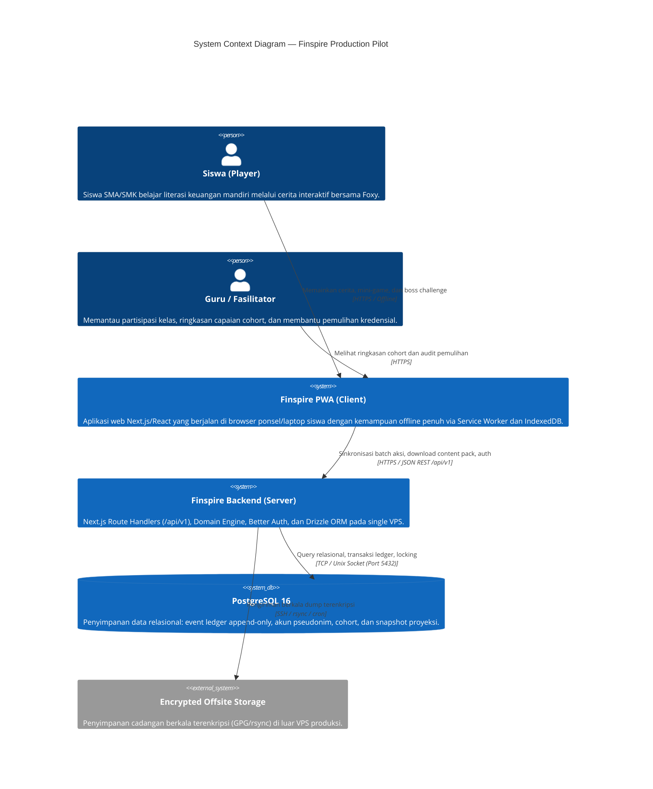
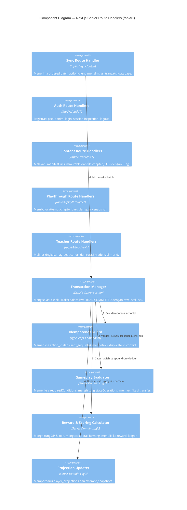
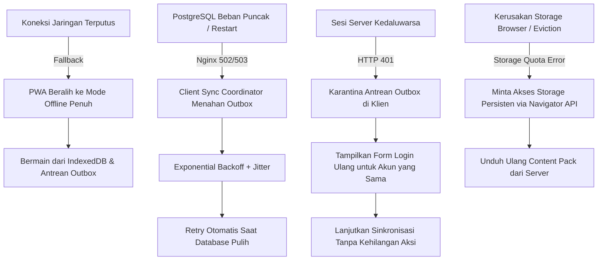

# Finspire System Architecture — Production Pilot

Dokumen ini mendefinisikan arsitektur sistem, batas runtime, alur data online/offline, batas kepercayaan (*trust boundaries*), dan topologi deployment untuk **Finspire Production Pilot**.

---

## 1. Konteks Sistem (C4 Context Diagram)

Finspire adalah aplikasi web progresif (*Progressive Web App* / PWA) offline-first yang melayani siswa sekolah (pengguna utama usia 16–17 tahun dalam rentang 16–24 tahun) dan guru/fasilitator sekolah.



---

## 2. Diagram Kontainer (C4 Container Diagram)

```mermaid
C4Container
    title Container Diagram — Finspire Production Pilot

    Container_Boundary(browser_boundary, "Browser Client (PWA)")
        Container(app_ui, "UI & Presentation Layer", "React 19, Tailwind CSS v4, Motion", "Komponen presentasi visual, dialog Foxy, HUD saldo, kartu microlearning.")
        Container(zustand_store, "Presentation State Store", "Zustand v5", "State ephemeral: modal terbuka, pilihan aktif, animasi, audio mute.")
        Container(local_engine, "Client Simulation Engine", "TypeScript Domain Logic", "Validasi lokal cepat untuk feedback interaktif seketika di client.")
        Container(sync_coordinator, "Offline Sync Coordinator", "TypeScript Worker / Manager", "Mengelola antrean outbox, sequencing, deteksi online, flush batch.")
        ContainerDb(idb, "IndexedDB (finspire_local_db)", "Browser IndexedDB API", "Store: content_packs, attempts, outbox_actions, local_projections, settings.")
        Container(sw, "Service Worker", "Cache API & Fetch Handler", "Precaching app shell, caching immutable assets (audio/img/anim), network-only routing untuk /api.")
    End

    Container_Boundary(server_boundary, "Production Host (Single VPS — Ubuntu 24.04)")
        Container(nginx, "Reverse Proxy & Web Server", "Nginx", "SSL termination (Let's Encrypt), rate limiting, gzip/brotli, routing static asset.")
        Container(pm2_node, "Application Server", "Node.js 22 LTS / Next.js 16 (PM2 Cluster)", "Next.js App Router Route Handlers (/api/v1).")
        Container(auth_module, "Authentication Module", "Better Auth", "Autentikasi pseudonim Player Code + Passphrase, cookie HttpOnly, RBAC.")
        Container(domain_engine, "Server Domain Engine", "Pure TypeScript", "Otoritatif: kalkulasi saldo multi-pos, aturan gating, rubrik penilaian boss, anti-farming.")
        Container(drizzle_orm, "Data Access Layer", "Drizzle ORM", "Type-safe query builder, migrasi skema versioned, serializable transaction isolation.")
        ContainerDb(postgres_db, "Relational Database", "PostgreSQL 16", "Tabel relasional, append-only reward ledger, row locks (FOR UPDATE), audit log.")
        Container(cron_backup, "Backup & Maintenance Worker", "Bash / Cron / pg_dump", "Automated daily snapshot, encryption via GPG, outbox housekeeping.")
    End

    Rel(app_ui, zustand_store, "Read/Write UI state")
    Rel(app_ui, local_engine, "Kirim pilihan lokal untuk preview")
    Rel(local_engine, idb, "Simpan state attempt lokal")
    Rel(local_engine, sync_coordinator, "Enlist action ke outbox")
    Rel(sync_coordinator, idb, "Append/Acknowledge outbox actions")
    Rel(sync_coordinator, nginx, "POST /api/v1/sync/batch saat online", "HTTPS / JSON")
    Rel(sw, nginx, "Fetch assets & app shell", "HTTPS")
    Rel(nginx, pm2_node, "Reverse proxy ke port lokal 3000", "HTTP/1.1")
    Rel(pm2_node, auth_module, "Verifikasi sesi & hak akses")
    Rel(pm2_node, domain_engine, "Eksekusi aksi gameplay & hitung konsekuensi")
    Rel(domain_engine, drizzle_orm, "Simpan event & update projection")
    Rel(auth_module, drizzle_orm, "Simpan sesi & akun")
    Rel(drizzle_orm, postgres_db, "SQL Queries & Transactions")
    Rel(cron_backup, postgres_db, "pg_dump harian")
```

---

## 3. Komponen Inti Server (C4 Component Diagram — Backend Engine)



---

## 4. Batas Kepercayaan & Sumber Kebenaran (*Trust Boundaries & Source of Truth*)

| Entitas State | Client (PWA / IndexedDB) | Server Backend (Next.js) | Database (PostgreSQL 16) | Status Kepemilikan (*Source of Truth*) |
|---|---|---|---|---|
| **Kredensial & Sesi** | Session Cookie (`HttpOnly`, `Secure`) | Session Validator (Better Auth) | Tabel `sessions` & `users` | **Server Authoritative** |
| **Katalog & Konten Chapter** | Read-Only Cache (Immutable) | Manifest Provider & Hasher | Disk File / Object Repo | **Content Release Immutable** |
| **Pilihan & Input Murid** | Local Action Creation (Outbox) | Untrusted Input Validation | Tabel `gameplay_actions` | **Client Origin $\rightarrow$ Server Certified** |
| **Saldo Simulasi (IDR)** | Optimistic Presentation Only | Domain Engine Calculation | Tabel `attempt_snapshots` | **Server Authoritative** |
| **XP, Koin, Badges** | Ephemeral Display UI | Anti-Farming Rules Engine | Tabel `reward_ledger` (Append-Only) | **Server Authoritative (Ledger)** |
| **Streak Hari Aktif** | Display Banner | Server Timezone (`Asia/Jakarta`) | Tabel `player_streaks` | **Server Authoritative** |
| **Cohort & Guru** | Display Roster | Authorization Gate (RBAC) | Tabel `cohorts` & `schools` | **Server Authoritative** |

> [!CRITICAL]
> **Aturan Otoritas Absolut**:
> Client dilarang mengirimkan nilai saldo baru, delta reward, status kelulusan, atau penambahan streak. Client **HANYA** mengirimkan tindakan mentah (`choiceId`, `optionId`, `score`, atau `artifactContent`). Server bertanggung jawab penuh menghitung seluruh mutasi keuangan, mengevaluasi rubrik, dan menerbitkan hak progres.

---

## 5. Alur Data Utama Sistem (*System Data Flows*)

### 5.1 Alur Registrasi Pertama & Unduhan Konten (*First-Login & Content-Pack Flow*)
1. Murid membuka aplikasi Finspire di peramban. Service worker melakukan precache app shell UI.
2. Murid mendaftar menggunakan nama panggilan / alias dan memilih kelompok sekolah via `Cohort Access Code` (misal: `SMK1-XAK`).
3. Server menerbitkan **Player Code** unik (format: `FOX-XXXX-YYY`) dan meminta murid mencatat **Passphrase** (4 kata aman).
4. Server menerbitkan sesi aman via cookie `HttpOnly`.
5. Klien memanggil `GET /api/v1/content/releases/pilot-v1/manifest`.
6. Klien mengunduh `chapter-01.json` dan `chapter-02.json` lalu menyimpannya ke object store `content_packs` pada IndexedDB.
7. Aplikasi siap dimainkan secara offline sepenuhnya.

### 5.2 Alur Bermain Offline (*Offline Play Flow*)
1. Murid memainkan Chapter 1 saat perangkat tidak terhubung ke internet (mode pesawat / lab sekolah tanpa WiFi).
2. Setiap kali murid memilih opsi:
   - Klien membangkitkan `actionId` (UUID v4) dan menaikkan `clientSequence` lokal.
   - Klien mengeksekusi logika simulasi lokal untuk memberikan umpan balik UI seketika (*optimistic feedback*).
   - Klien menyimpan aksi ke store `outbox_actions` di IndexedDB dengan status `PENDING_SYNC`.
   - Saldo lokal diperbarui pada store `attempts` di IndexedDB.
3. Kuis transfer scenario dan mini-game dimainkan secara lokal dengan data yang ada di content pack.

### 5.3 Alur Rekoneksi & Sinkronisasi Batch (*Reconnect Sync Flow*)
1. Perangkat mendeteksi sinyal internet (event `window.online` atau pemicu visibilitas aplikasi).
2. `SyncCoordinator` membaca seluruh aksi berstatus `PENDING_SYNC` dari IndexedDB terurut berdasarkan `clientSequence`.
3. Klien mengirimkan `POST /api/v1/sync/batch` berisi array aksi.
4. Server memproses batch dalam satu transaksi database:
   - Memverifikasi kepemilikan instalasi dan sesi murid.
   - Memvalidasi setiap aksi secara deterministik terhadap scene graph dan aturan ekonomi.
   - Menuliskan event ke `gameplay_actions` dan reward ke `reward_ledger`.
   - Mengembalikan array hasil (`accepted`, `duplicate`, `conflict`, atau `rejected`) serta `canonicalSnapshot`.
5. Klien menerima respons:
   - Menghapus aksi `accepted` dan `duplicate` dari outbox lokal.
   - Menyelaraskan saldo lokal dengan `canonicalSnapshot` dari server.
   - Jika terdapat `conflict` (misal aksi berbeda pada adegan yang sama), klien menampilkan dialog penyesuaian Foxy tanpa menghapus data privat.

### 5.4 Alur Pemantauan Guru & Pemulihan Kredensial (*Teacher Flow*)
1. Guru masuk menggunakan akun fasilitator sekolah (kredensial terdaftar).
2. Guru memanggil `GET /api/v1/teacher/cohorts/{cohortId}/summary`.
3. Server memvalidasi bahwa guru tersebut terdaftar sebagai pembimbing cohort tersebut (*Broken Object-Level Authorization Guard*).
4. Server mengembalikan data agregat: persentase murid yang telah menyelesaikan Chapter 1, distribusi identitas (`Survivor`, `Planner`), dan daftar murid yang membutuhkan bantuan.
5. Jika ada murid lupa passphrase: Guru dapat memicu `POST /api/v1/teacher/students/{studentId}/reset-credential` di bawah pengawasan kelas. Tindakan ini dicatat ke `audit_logs`.

---

## 6. Topologi Deployment & Batas Operasional Single-VPS

Finspire production pilot dirancang efisien untuk di-hosting pada **Single Virtual Private Server (VPS)** tanpa ketergantungan SaaS berbayar.

### 6.1 Spesifikasi Baseline Server
- **OS**: Ubuntu 24.04 LTS x64.
- **Hardware Minimum**: 2 vCPU, 4 GB RAM, 40 GB NVMe SSD.
- **Web Server / Reverse Proxy**: Nginx 1.24+ dengan modul HTTP/2 dan Gzip/Brotli.
- **Process Manager**: PM2 v5+ (menjalankan 2 worker cluster Next.js standalone).
- **Database**: PostgreSQL 16 (tuning buffer: `shared_buffers = 1GB`, `work_mem = 16MB`).
- **Node.js**: v22 LTS (Active).

### 6.2 Mode Kegagalan & Penanganan Penurunan Layanan (*Failure Modes & Degraded Behavior*)



### 6.3 Jalur Penskalaan Masa Depan (*Future Scaling Seams*)
Meskipun pilot beroperasi pada single-VPS, desain modul menjamin jalur pemisahan mudah saat beban bertambah:
1. **Pemisahan Database**: Database PostgreSQL dapat dipindahkan ke managed DB cluster tanpa mengubah kode aplikasi.
2. **Pemisahan Asset Hosting**: Direktori content release dan aset media dapat dipindahkan ke S3-compatible Object Storage (MinIO / Cloudflare R2) cukup dengan memperbarui URL CDN di `assetDictionary`.
3. **Pemisahan Background Worker**: Pemrosesan analitik agregat dan batch notification dapat dipindahkan ke worker process terpisah via Redis / BullMQ.
