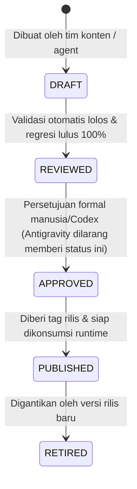

# Content Specification & Pilot Release — Finspire

Dokumen ini adalah panduan tata kelola, validasi, dan lifecycle konten edukatif untuk **Finspire Production Pilot**.

---

## 1. Tujuan Pilot dan Batas Ruang Lingkup

Finspire adalah PWA permainan simulasi cerita interaktif yang mengajarkan literasi keuangan dasar kepada remaja Indonesia (fokus usia 16–17 tahun dalam rentang target 16–24 tahun) bersama maskot **Foxy**.

### Batas Pilot (Chapter 1 & 2)
- **Chapter 1: KEEP IT ALIVE (PRESERVE — Keep Your Money)**:
  Fokus pada pencatatan dasar, membedakan kebutuhan vs keinginan, konsekuensi langsung pengeluaran, navigasi pengeluaran tak terduga tanpa penambahan pemasukan buatan, dan menyusun rencana bertahan hidup (*My 7-Day Money Survival Plan*).
  - *Gelar Identitas*: **Survivor**
  - *Artefak Mastery*: **My 7-Day Money Survival Plan**
- **Chapter 2: PAY YOURSELF FIRST (PROTECT — Protect Your Money)**:
  Fokus pada alokasi pendapatan berimbang, prioritas proteksi sebelum konsumsi, pembentukan dana darurat multi-pos, pemanfaatan dana darurat saat terjadi musibah tak terduga tanpa berutang, dan menyusun cetak biru proteksi finansial (*Build Your Financial Shield Blueprint*).
  - *Gelar Identitas*: **Planner**
  - *Artefak Mastery*: **Build Your Financial Shield Blueprint**
- **Chapter 3–5 (Roadmap & Spesifikasi Konseptual)**:
  - Chapter 3: **DON'T ENTER THE TRAP** (DEFEND — Protect Yourself) — *Gelar: Guardian* — *Artefak: Build Your Financial Firewall*
  - Chapter 4: **BUILD YOUR MONEY ENGINE** (PRODUCE — Create Money) — *Gelar: Value Creator* — *Artefak: Earn Your First Money / Mini Business Blueprint*
  - Chapter 5: **BUILD WEALTH SLOWLY** (GROW — Grow Money) — *Gelar: Wealth Builder* — *Artefak: My Personal Money Constitution*
  Didefinisikan secara konseptual dan arsitektural di dokumen spesifikasi, namun **DILARANG** diproduksi sebagai konten executable pada fase ini (masuk roadmap post-pilot).

---

## 2. Struktur Repositori Konten

```text
docs/content/
├── README.md                 <- Panduan tata kelola & ringkasan ini
├── SOURCE_EVIDENCE.md        <- Matriks klaim sumber (DOCX kanonikal) vs fakta vs inferensi & 6 konflik internal
├── PILOT_CONTENT_SPEC.md     <- Spesifikasi pedagogis, core loop, Foxy state, mastery artifacts, & safety
├── ECONOMY_AND_SCORING.md    <- Formula simulasi multi-pos, XP, koin, streak, & rekonsiliasi matematis
├── OPEN_DECISIONS.md         <- Daftar keputusan produk/pedagogis (active vs superseded)
└── STATUS.md                 <- Lembar status persetujuan (wajib PROPOSED sebelum review manusia)

content/
├── schema/
│   └── content-release.schema.json   <- Kontrak JSON Schema Draft 2020-12 (stateOperations, transfers, masteryArtifact)
└── releases/
    └── pilot-v1-draft/
        ├── manifest.json             <- Manifest paket rilis konten pilot v1
        ├── chapter-01.json           <- Scene graph, dialog, choices, mini-game, & boss Ch1 (KEEP IT ALIVE)
        └── chapter-02.json           <- Scene graph, multi-account ledger, mini-game, & boss Ch2 (PAY YOURSELF FIRST)

scripts/
├── validate-content.mjs              <- Script validator integritas konten mandiri (Node.js built-in)
└── test-validator-regressions.mjs    <- Test suite regresi validator 13 kategori kesalahan model kegagalan
```

---

## 3. Siklus Hidup Rilis Konten (Content Lifecycle)

Setiap paket konten (*content pack*) wajib melalui lima tahap status formal:



1. **`DRAFT`**:
   Konten dalam penyusunan. Boleh memuat varian proposal, namun wajib valid secara skema dan graf.
2. **`REVIEWED`**:
   Telah diverifikasi oleh script validator (`scripts/validate-content.mjs`) dan suite regresi (`scripts/test-validator-regressions.mjs`), seluruh kalkulasi saldo terbukti terkonsiliasi, dan diverifikasi peer reviewer.
3. **`APPROVED`**:
   Telah disetujui secara tertulis oleh tim produk, pedagogi, dan engineering. Antigravity **DILARANG** memberikan status ini secara mandiri.
4. **`PUBLISHED`**:
   Paket rilis dibekukan (*immutable*). Sekali dipublikasikan, ID dan hash paket tidak boleh diubah. Perubahan konten wajib membuat versi rilis baru (misal: `pilot-v2`).
5. **`RETIRED`**:
   Versi lawas yang diarsipkan namun tetap dapat dibaca oleh sistem untuk menjaga riwayat progres pemain terdahulu.

> [!IMPORTANT]
> **Aturan Immutabilitas Rilis Publik**:
> Progres pemain di database selalu mengikat ke `contentVersion` dan `releaseId` tertentu. Memperbarui cerita atau memperbaiki salah ketik pada rilis yang sudah `PUBLISHED` dilakukan dengan menerbitkan rilis baru, bukan menimpa file rilis lama.

---

## 4. Cara Memvalidasi Paket Konten

Validasi konten dijalankan secara lokal tanpa dependensi pihak ketiga menggunakan modul Node.js bawaan:

```bash
# 1. Menjalankan test suite regresi validator (13 kategori kegagalan buatan)
npm run test:content
# Atau: node scripts/test-validator-regressions.mjs

# 2. Menjalankan validasi konten rilis penuh (skema, ID global, saldo, integritas graf, secret/PII)
npm run content:validate
# Atau: node scripts/validate-content.mjs
```

Validator memeriksa:
- Kepatuhan struktur JSON Schema Draft 2020-12 (termasuk `$defs` untuk `stateOperations`, `transfers`, `masteryArtifact`).
- Keunikan global semua identifier lintas-chapter (`releaseId`, `chapterId`, `sceneId`, `choiceId`, `miniGameId`, `bossChallengeId`).
- Konsistensi graf simpul (semua `startSceneId`, `nextSceneId`, `successNextSceneId`, dan `failureNextSceneId` terhubung ke simpul valid atau keluar rilis dengan benar).
- Rekonsiliasi matematis saldo & konservasi saldo multi-pos:
  - Chapter 1: Menelusuri seluruh jalur hingga simpul terminal, membuktikan tidak pernah negatif ($\ge 0$).
  - Chapter 2: Membuktikan persamaan konservasi dana multi-pos:
    $$\text{Total Inflow} = \text{Available Cash} + \text{Goal Savings} + \text{Emergency Fund} + \text{Cumulative Expenses} + \text{Acquired Assets} - \text{Explicit Debt}$$
- Kepatuhan referensi status keputusan `OPEN_DECISIONS.md` (membedakan keputusan `ACTIVE` vs `SUPERSEDED`, menolak referensi ke keputusan usang).
- Larangan teks placeholder seperti `TODO`, `TBD`, string kosong, atau URL aset tiruan/dummy.

---

## 5. Daftar Stakeholder & Owner Review

| Bidang Review | Fokus Pemeriksaan | Penanggung Jawab |
|---|---|---|
| **Pedagogi & Edukasi** | Tone bahasa, efektivitas transfer scenario, rubrik boss challenge, pembingkaian kemiskinan/survival tanpa menyalahkan korban | Reifan Putra Pratama (Hustler) / Penasihat Edukasi |
| **Desain & Interaksi** | Alur dialog Foxy, kesesuaian mood/state, keterbacaan microlearning, aksesibilitas non-drag | Faiz Baraka Putra (Hipster) |
| **Sistem & Rekonsiliasi Data** | Kepatuhan skema JSON, determinisme validator, integritas ID, formula ekonomi integer multi-pos | Arrasyd Nanda Fairuz (Hacker) |
| **Final Sign-Off Gate** | Evaluasi gate Fase 01R, resolusi keputusan blocking di `OPEN_DECISIONS.md` | Human Reviewer / Codex Lead |
